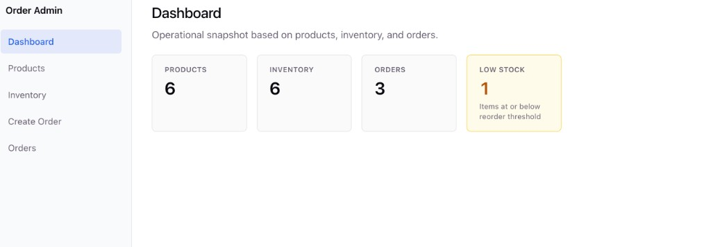
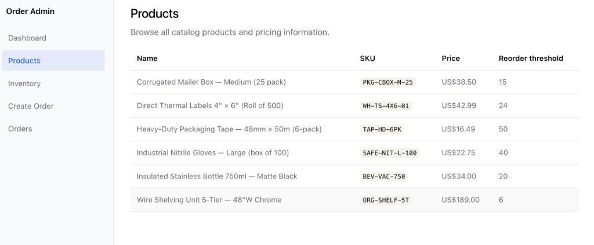
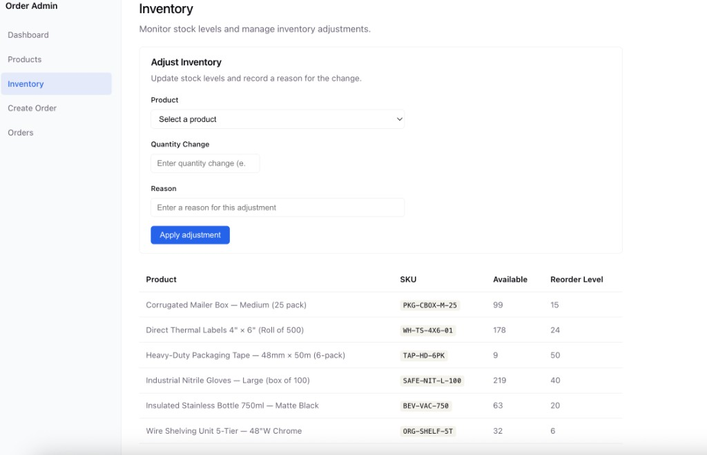
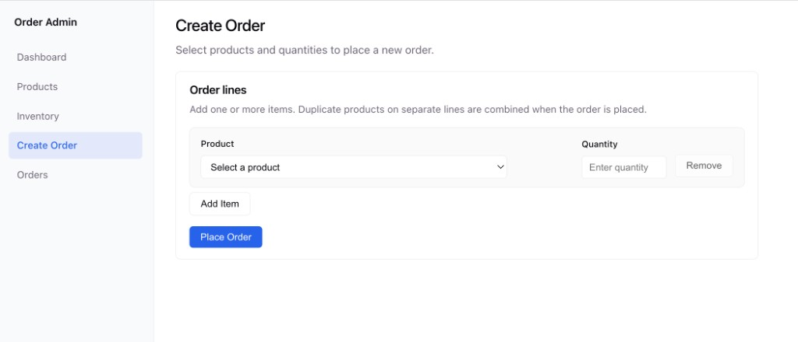
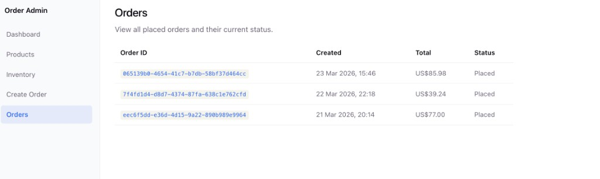

# Order Inventory Platform

Order Inventory Platform is a clean-architecture sample for managing catalog products, order placement, and inventory movements with transactional consistency.

It is designed to be practical for interviews: clear domain boundaries, explicit business rules, focused application handlers, and a minimal admin UI on top of the same APIs.

## Quick start

1. **PostgreSQL** — either a local instance matching `appsettings.json`, or Docker (recommended if `localhost:5432` is already taken):

   ```bash
   # Example: map container to host port 55432 when 5432 is busy
   POSTGRES_PORT=55432 docker compose up -d postgres
   ```

2. **Backend** — from `backend/`:

   ```bash
   dotnet run --project src/OrderInventoryPlatform.Api/OrderInventoryPlatform.Api.csproj
   ```

   Default HTTP URL: **http://localhost:5241** · Swagger (Development): **http://localhost:5241/swagger**

   If Postgres runs on a **non-default port** (e.g. `55432`), override the connection string for this shell:

   ```bash
   export ConnectionStrings__DefaultConnection='Host=localhost;Port=55432;Database=order_inventory_db;Username=postgres;Password=postgres'
   dotnet run --project src/OrderInventoryPlatform.Api/OrderInventoryPlatform.Api.csproj
   ```

3. **Frontend** — from `frontend/`:

   ```bash
   npm install
   npm run dev
   ```

   Open **http://localhost:5173** — Vite proxies `/api` to the backend (`frontend/vite.config.ts`).

**Note:** `global.json` pins **.NET SDK 8.0.125**. If `dotnet --version` shows a different major version, install [.NET 8 SDK](https://dotnet.microsoft.com/download/dotnet/8.0) or on macOS with Homebrew: `brew install dotnet@8` and use e.g. `/opt/homebrew/opt/dotnet@8/libexec/dotnet` for `dotnet` commands.

## Project Overview

- Monorepo with:
  - **`backend/`** — ASP.NET Core Web API (.NET 8)
  - **`frontend/`** — React + TypeScript + Vite admin dashboard
- Primary goal: keep inventory as a single source of truth while supporting realistic order and adjustment workflows.

## Architecture Summary

Backend follows a layered clean architecture:

- `OrderInventoryPlatform.Domain` — entities, value rules, invariants
- `OrderInventoryPlatform.Application` — use-case handlers (`PlaceOrder`, `AdjustInventory`), interfaces, result contracts
- `OrderInventoryPlatform.Infrastructure` — EF Core persistence, repositories, query services, unit of work
- `OrderInventoryPlatform.Api` — thin REST controllers + DI wiring + Swagger

Key design points:

- Controllers are thin and delegate to application handlers.
- Domain enforces invariants (for example, inventory cannot go below zero).
- Write operations are persisted atomically via `IUnitOfWork.ExecuteInTransactionAsync(...)`.

## Domain Modules

### Catalog

- `Product` — SKU, name, price, reorder threshold

### Orders

- `Order` + `OrderLine` — order lines snapshot product pricing at order time
- `PlaceOrder` validates products and stock before persistence

### Inventory

- `InventoryItem` — current available quantity per product
- `InventoryMovement` — immutable audit trail: `In`, `Out`, `Adjustment`
  - Outbound movements are linked to orders
  - Adjustment movements store a business reason

## Key Business Flows

### PlaceOrder

1. Validate input lines and quantities.
2. Ensure all products exist.
3. Ensure inventory rows exist and stock is sufficient.
4. Aggregate duplicate product lines.
5. Create order + order lines.
6. Decrease inventory and create outbound movements.
7. Commit all changes in one transaction.

### AdjustInventory

`POST /api/inventory/adjustments` — body: `productId`, `quantityDelta`, `reason`

1. Validate product, delta, and reason.
2. If no inventory row exists: positive delta creates stock; negative delta is rejected.
3. If inventory exists, apply signed adjustment.
4. Prevent inventory from going below zero.
5. Create `InventoryMovement` of type `Adjustment`.
6. Commit inventory + movement atomically.

## Frontend Admin Dashboard

Single-page app with sidebar layout (`AdminLayout`) and client-side routing.

| Route | Purpose |
|--------|---------|
| `/` | **Dashboard** — summary cards (product count, inventory rows, orders, low-stock count) |
| `/products` | Product catalog table |
| `/inventory` | Stock table + inventory adjustment |
| `/orders/create` | Multi-line place order |
| `/orders` | Order list with links to details |
| `/orders/:id` | Order detail + line items |

- **HTTP client:** Axios with typed DTOs aligned to backend JSON (camelCase).
- **Dev proxy:** Vite proxies `/api` to the API (see `frontend/vite.config.ts`, default `http://localhost:5241`).
- **Optional direct API URL:** set `VITE_API_BASE_URL` (or legacy `VITE_API_URL`) in `frontend/.env.local` — see `frontend/.env.example`.

```bash
cd frontend
npm install
npm run dev    # http://localhost:5173
npm run build  # production build
npm run lint
```

## Deployed App Screenshots

### Dashboard


### Products


### Inventory


### Create Order


### Orders


## Tech Stack

- .NET 8 (`global.json` pins SDK `8.0.125`)
- ASP.NET Core Web API
- Entity Framework Core + PostgreSQL
- xUnit (application handler tests)
- Swagger/OpenAPI
- React 19 + TypeScript + Vite 8 + React Router + Axios

## Run Locally (detailed)

### Prerequisites

- .NET 8 SDK (see Quick start if `dotnet` resolves to another version)
- PostgreSQL, or Docker (`docker-compose.yml` at repo root)
- Node.js 20+ (for the frontend)

### Backend

```bash
cd backend
dotnet restore
dotnet build src/OrderInventoryPlatform.Api/OrderInventoryPlatform.Api.csproj
dotnet run --project src/OrderInventoryPlatform.Api/OrderInventoryPlatform.Api.csproj
```

**Building the solution file:** `OrderInventoryPlatform.slnx` requires a toolchain that supports the newer solution format. If `dotnet build OrderInventoryPlatform.slnx` fails, build individual projects (e.g. the `Api` project above) or use a current .NET SDK.

Default connection string: `backend/src/OrderInventoryPlatform.Api/appsettings.json`

- Host: `localhost`, port: `5432`, database: `order_inventory_db`, user/password: `postgres/postgres`

If authentication fails, another Postgres instance may be bound to `5432` with different credentials — use Docker on another port (see Quick start) or align credentials.

Swagger UI (Development): `/swagger`

### Frontend

```bash
cd frontend
npm install
npm run dev
```

Ensure the API is running so the proxy (or `VITE_API_BASE_URL`) can reach it.

## Migrations

### Automatic on startup

- `Database:ApplyMigrationsOnStartup` — enabled in `appsettings.Development.json` by default

### Manual

From `backend/`:

```bash
dotnet ef database update --project src/OrderInventoryPlatform.Infrastructure --startup-project src/OrderInventoryPlatform.Api
```

Add a migration:

```bash
dotnet ef migrations add <MigrationName> --project src/OrderInventoryPlatform.Infrastructure --startup-project src/OrderInventoryPlatform.Api
```

## Development Seed Data

- `backend/src/OrderInventoryPlatform.Infrastructure/Persistence/DevelopmentDataSeeder.cs`
- Runs only in **Development**
- **Idempotent:** if any product already exists, seeding is skipped
- Seeds sample products and matching `InventoryItem` rows

## Run Tests

**Backend** (from `backend/`):

```bash
dotnet test
```

Or:

```bash
dotnet test tests/OrderInventoryPlatform.Application.Tests/OrderInventoryPlatform.Application.Tests.csproj
```

**Frontend:**

```bash
cd frontend
npm run lint
npm run build
```

## API Demo (Swagger or UI)

1. Start the API and open Swagger at `/swagger` **or** open the frontend at **http://localhost:5173** (`npm run dev`).
2. **Products** — browse catalog; pick a product id for orders/adjustments.
3. **Inventory** — view stock; use adjustment when needed.
4. **Create Order** — one or more lines (duplicate products aggregate server-side).
5. **Inventory** again — verify stock after an order.
6. **Orders** → **Order Details** for a placed order.
7. (Optional) Invalid adjustment or order to see structured business errors.

## Docker (optional)

From the repo root, copy `env/.env.docker.example` to `.env.docker`, then:

```bash
docker compose --env-file .env.docker up --build
```

See `env/README.md` for environment notes.

## Azure / production

See `infra/azure/README.md` and `env/env.azure.example` for deployment-oriented configuration.
